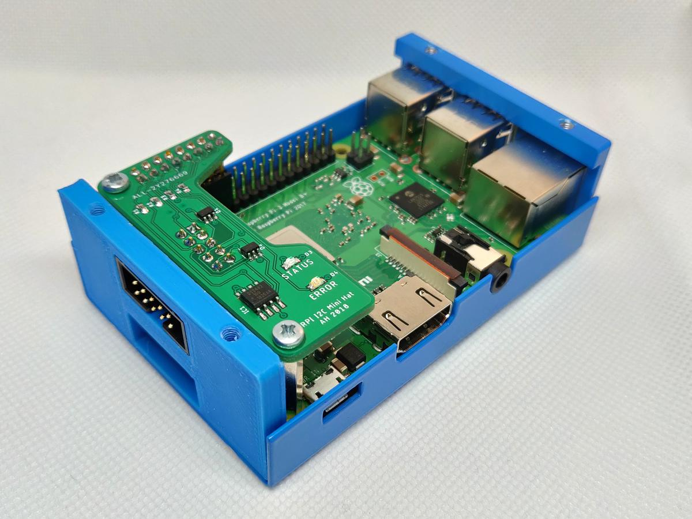

# Log of project 

## 0. Idea

I would like to try Autodesk Eagle and Fusion 360 integration for electrical and 3d mechanical design. 

## 1. Requirements

- Add connector for external sensors to my Raspberry Pi
- Must fit into my existing box (**[EM-RasPI B+](https://www.emko.cz/produkty/it-skrine/raspberry-pi/em-raspi-b-silver-h3564)**)
- Expose on connector:
	- 1-Wire
	- I2C
	- 5V and 3.3V power supply for sensor
	- Some GPIO if there are unused pins
- Basic ESD protection

## 2. Components

For 1-Wire interface there is DS2482-100 (1-Wire to I2C bridge), this is more reliable then emulated 1-Wire interface form SW.

Each pin is protected by SP0504S TVS Diode Array.

Main connector was selected from 3M mainly because the have STEP file for it... 

- [BOM](doc/rpi-i2c-bom.csv)

## 3. Schematics

Schematics was design in Autodesk Eagle.

<em>Eagle - schematics</em>

- [Schematics (PDF)](https://github.com/ah01/rpi-i2c-mini-hat/raw/master/doc/rpi-i2c-sch.pdf)

## 4. PCB Layout

Schematics was design in Autodesk Eagle.

<em>Eagle - PCB Layout</em>

<em>Eagle - PCB preview</em>

- [Top](https://github.com/ah01/rpi-i2c-mini-hat/blob/master/doc/rpi-i2c-pcb-top.png)
- [Bottom](https://github.com/ah01/rpi-i2c-mini-hat/blob/master/doc/rpi-i2c-pcb-bottom.png)
- Gerber files are in download section

PCB was order from [AllPCB](https://allpcb.com/) (and delivered in 4 days for 10$ - incredible).

## 5. 3D Design

PCB for exported (via Fusion 360 integration in Eagle) to Fusion 360. And then whole box and RPI was build around PCB. RPI model come from [here](https://www.thingiverse.com/thing:2572698).

<em>Fusion 360 - Home view</em>

<em>Fusion 360 - PCB Detail</em>

<em>Fusion 360 - Just PCB</em>

<em>Fusion 360 - Side panel of box</em>

## 6. 3D Print of side panel

Side panel of box need to be replaced by new one with hole for connector.

- [STL File](panel/panel.stl)

## 7. Final assembly

### Visualization

### Rality

### Photos

